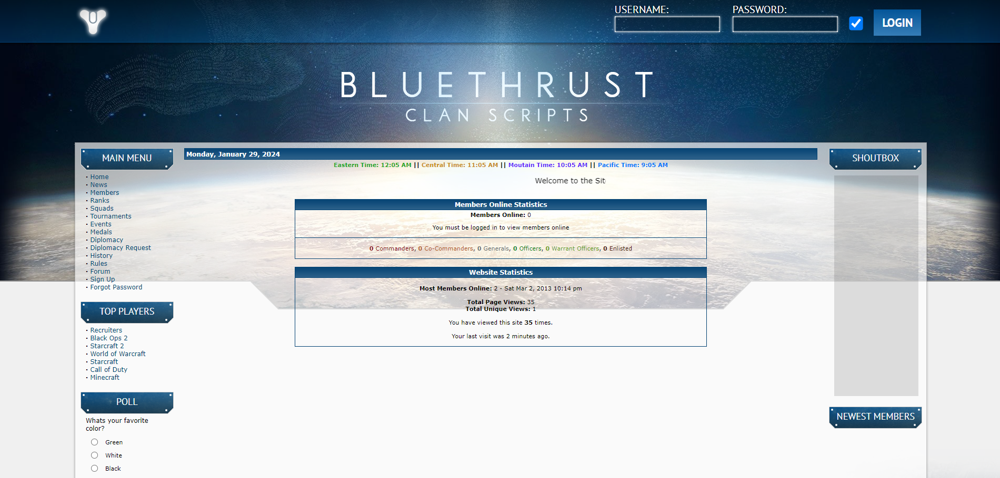
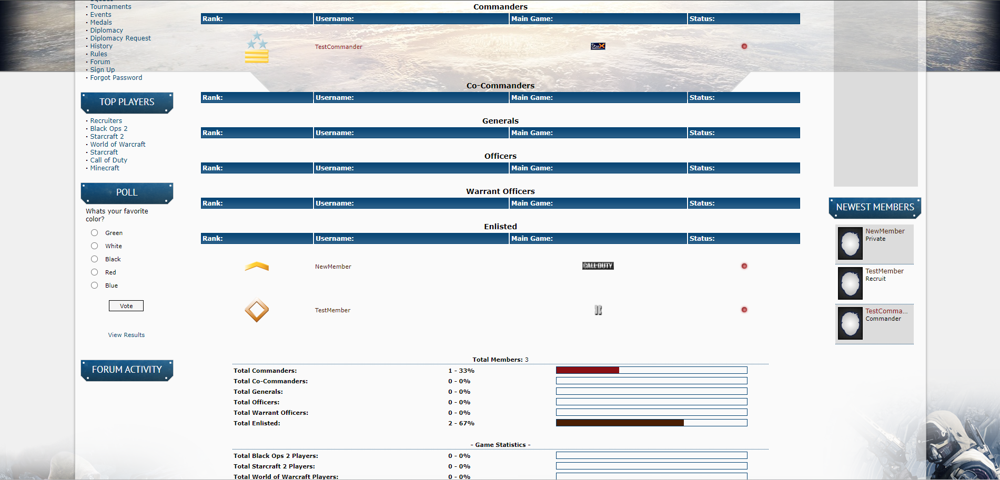
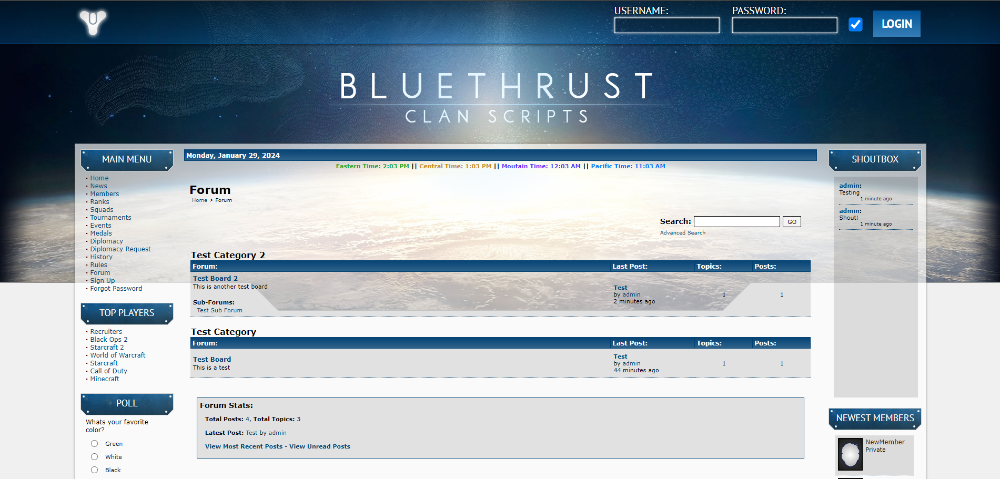

# BlueThrust Clan Scripts v5 ==

## What are Clan Scripts?

"Clan Scripts" are a website engine (CMS) for gaming communities. BlueThrust is one of the best clan scripts created during the Battle.net era of clan websites (Starcraft: Brood War, 2000-2005).

## This is a fork of BlueThrust 4

The original author was nice enough to open source the scripts, [created a GitHub](https://github.com/bluethrust/clanscripts) for them, and released them with a license that allowed modification and redistribution.

However, the original author went inactive in 2014, and these scripts are now abandonware.

I was hired by a client in 2020 to update these scripts and add features. As a result, I became pretty familiar with them.

This repository is a fork of the BlueThrust 4 scripts, and I am going to share some of the changes I made for my client. I am naming this fork BlueThrust Clan Scripts v5.

## Features

- Military ranking system (M26)
- Days since login (DSL) system - requires members to log in every X days or be auto disabled
- Integrated forum
- Multiple skins
- Permissions - the higher the rank, the more website access
- Public & internal news
- Squads
- Tournaments
- Events
- Medals
- Diplomacy
- Custom pages
- Top players
- Logging
- Private messages
- Upload files / upload forum post attachments
- Customizable control panel menu
- Shoutbox

## Bugs, Security Issues, Feature Requests

Please report all bugs, security issues, and feature requests.

Create a GitHub account, then [create an issue](https://github.com/RedDragonWebDesign/BlueThrust5).

## Setup Guide

[Click here](https://github.com/RedDragonWebDesign/BlueThrust5/wiki/Setup-Guide)

Setup can be complicated. You can hire me to set up and manage your website for you if you'd like. https://www.RedDragonWebDesign.com/contact/

## Code Quality

The code in this project is workable. I was able to patch in the things my client wanted. But there are several areas that need modernization:

- Was designed for PHP 5. Huge number of notices and warnings when running on PHP 7.4
- Does not follow MVC ([Model View Controller](https://en.wikipedia.org/wiki/Model%E2%80%93view%E2%80%93controller)). MVC is the excellent practice of separating SQL, HTML, and PHP into different files.
- Many skins, but the skins are not mobile friendly.

## Screenshots

