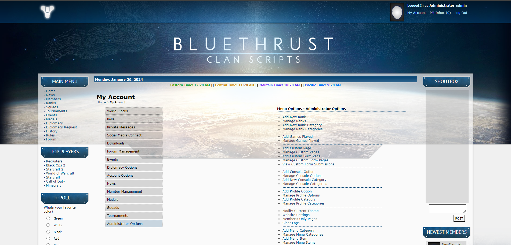

# BlueThrust Clan Scripts v5

## Download Link

[Stable Release](https://github.com/RedDragonWebDesign/BlueThrust5/releases) - same as v4, no changes yet

[Development Release - May Contain Bugs](https://github.com/RedDragonWebDesign/BlueThrust5/archive/master.zip)

## Setup Guide

[Click here](https://github.com/RedDragonWebDesign/BlueThrust5/wiki/Setup-Guide)

## What are Clan Scripts?

"Clan Scripts" are a website engine (CMS) for gaming communities. BlueThrust is one of the best clan scripts created during the Battle.net era of clan websites (Starcraft: Brood War, 2000-2005).

## This is a fork of BlueThrust 4

The original author was nice enough to open source the scripts, [created a GitHub](https://github.com/bluethrust/clanscripts) for them, and released them with a license that allowed modification and redistribution.

I attempted to contact him via a couple of different email addresses. I didn't get a response. The original GitHub hasn't been updated since 2014. The BlueThrust.com website has a version of the scripts that haven't been updated since 2016.

I was hired by a client in 2020 to update these scripts and add features. As a result, I became pretty familiar with them.

This repository is a fork of the BlueThrust 4 scripts, and I am going to share some of the changes I made for my client. I am naming this fork BlueThrust Clan Scripts v5.

## Features

- Military ranking system (M26)
- Days since login (DSL) system - requires members to log in every X days or be auto disabled
- Integrated forum
- Multiple skins
- Permissions - the higher the rank, the more website access
- Public & internal news
- Squads
- Tournaments
- Events
- Medals
- Diplomacy
- Custom pages
- Top players
- Logging
- Private messages
- Upload files / upload forum post attachments
- Customizable control panel menu
- Shoutbox

## Bugs, Security Issues, Feature Requests

Please report all bugs, security issues, and feature requests.

Create a GitHub account, then [create an issue](https://github.com/RedDragonWebDesign/BlueThrust5).

## Need help?

Do you just want these scripts up and running? Not interested in the technical details? I'm available for hire. I can help with any/all of the following:

- Buying a domain name
- Buying web hosting
- Installing and configuring BlueThrust
- Making custom modifications to BlueThrust

[Click here](https://www.reddragonwebdesign.com/contact/) to send me an email.

## Themes

Would you like a different website skin? There are 29 to choose from. Head on over to the [BlueThrust5-Themes repository](https://github.com/RedDragonWebDesign/BlueThrust5-Themes). I did not create these, they are from the BlueThrust website. But I am maintaining them on GitHub so that I can keep their code up to date.

## Developer Notes

Interested in contributing? Here's some [developer notes](https://github.com/RedDragonWebDesign/BlueThrust5/wiki/Developer-Notes).

## Leave A Star

If you like this fork or found it useful, please consider leaving us a star.

## Screenshots

